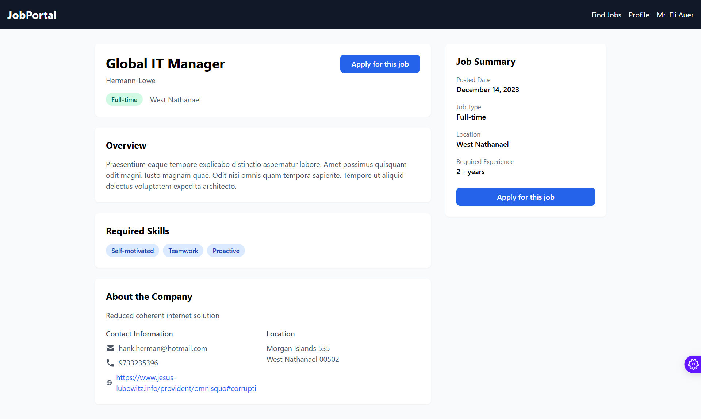
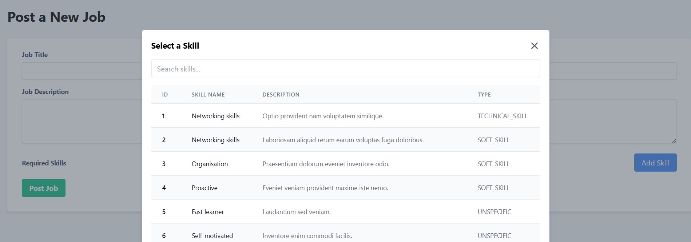

# **recruitment website**

## Thông tin
#### **Trường**: Đại học Công nghiệp TP Hồ Chí Minh - IUH
#### **Họ tên**: Nguyễn Đức Thịnh
#### **Mã sinh viên**: 21074131
#### **Giảng viên hướng dẫn**: Võ Văn Hải
#### **Công nghệ**: Spring MVC, Spring Boot
 **File báo cáo**: [Tại đây](https://github.com/thinhdz1500/WorldWideWeb/blob/main/LabWeek5/report.docx)
-------------------
## Tổng Quan
Đây là một ứng dụng web cổng thông tin việc làm được xây dựng bằng Spring Boot, kết nối người tìm việc (ứng viên) với nhà tuyển dụng (công ty). Ứng dụng có các tính năng như xác thực người dùng, đăng tin tuyển dụng, quản lý hồ sơ ứng viên, kết nối kỹ năng và thông báo qua email.

## Tính Năng
- **Xác Thực Người Dùng**
    - Cổng đăng nhập riêng biệt cho ứng viên và công ty
    - Quản lý phiên làm việc

- **Tính Năng Cho Ứng Viên**
    - Quản lý hồ sơ
    - Quản lý kỹ năng (thêm, cập nhật, xóa kỹ năng)
    - Tìm kiếm và ứng tuyển công việc
    - Gợi ý công việc dựa trên kỹ năng

- **Tính Năng Cho Công Ty**
    - Quản lý hồ sơ công ty
    - Đăng thông tin tuyển dụng
    - Tìm kiếm ứng viên dựa trên kỹ năng
    - Hệ thống gửi lời mời qua email cho ứng viên tiềm năng

## Công Nghệ Sử Dụng
- **Backend**
    - Spring Boot 3.x
    - Spring Security
    - Spring Data JPA
    - Spring Mail
    - HeidiSQL

- **Frontend**
    - Thymeleaf template engine
    - TailwindCSS
    - JavaScript

## Cấu trúc dự án

## Cài Đặt và Chạy Ứng Dụng

1. Clone repository:
```bash
git clone https://github.com/thinhdz1500/WorldWideWeb.git
```
## cấu hình cơ sở dữ liệu
```bash
  spring.datasource.url=jdbc:mysql://localhost:3306/your_database
  spring.datasource.username=your_username
  spring.datasource.password=your_password
```
## cấu hình email trong application.properties
```bash
spring.mail.host=smtp.gmail.com
spring.mail.port=587
spring.mail.username=your-email@gmail.com
spring.mail.password=your-app-password
spring.mail.properties.mail.smtp.auth=true
spring.mail.properties.mail.smtp.starttls.enable=true
```
## build và chạy ứng dụng
```bash
./gradlew bootRun
```
Ứng dụng sẽ chạy tại địa chỉ `http://localhost:8080`
## Cấu trúc dự án

## Cài Đặt và Chạy Ứng Dụng

1. Clone repository:
```bash
git clone https://github.com/thinhdz1500/WorldWideWeb.git
```

2. Cấu hình cơ sở dữ liệu MySQL trong `application.properties`:


```plaintext
spring.datasource.url=jdbc:mysql://localhost:3306/your_database
spring.datasource.username=your_username
spring.datasource.password=your_password
```

3. Cấu hình email trong `application.properties`:


```plaintext
spring.mail.host=smtp.gmail.com
spring.mail.port=587
spring.mail.username=your-email@gmail.com
spring.mail.password=your-app-password
spring.mail.properties.mail.smtp.auth=true
spring.mail.properties.mail.smtp.starttls.enable=true
```

4. Build và chạy ứng dụng:


```shellscript
./gradlew bootRun
```

Ứng dụng sẽ chạy tại địa chỉ `http://localhost:8080`


## Cài Đặt và Chạy Ứng Dụng

1. Clone repository:
```bash
git clone https://github.com/thinhdz1500/WorldWideWeb.git
```

2. Cấu hình cơ sở dữ liệu MySQL trong `application.properties`:


```plaintext
spring.datasource.url=jdbc:mysql://localhost:3306/your_database
spring.datasource.username=your_username
spring.datasource.password=your_password
```

3. Cấu hình email trong `application.properties`:


```plaintext
spring.mail.host=smtp.gmail.com
spring.mail.port=587
spring.mail.username=your-email@gmail.com
spring.mail.password=your-app-password
spring.mail.properties.mail.smtp.auth=true
spring.mail.properties.mail.smtp.starttls.enable=true
```

4. Build và chạy ứng dụng:


```shellscript
./gradlew bootRun
```

Ứng dụng sẽ chạy tại địa chỉ `http://localhost:8080`

## Giao Diện và Chức Năng Chính

### Trang Chủ


- Giới thiệu tổng quan về cổng thông tin việc làm
- Liên kết đến trang đăng nhập cho ứng viên và công ty


### Đăng Nhập


- Xác thực thông tin đăng nhập


### Trang Quản Lý Hồ Sơ Ứng Viên


- Hiển thị và chỉnh sửa thông tin cá nhân
- Quản lý danh sách kỹ năng và mức độ thành thạo


### Trang Tìm Kiếm Việc Làm


- Tìm kiếm công việc theo từ khóa, kỹ năng, và địa điểm
- Hiển thị danh sách công việc phù hợp
### Trang chi tiết công việc


### Trang Quản Lý Công Ty


- Quản lý thông tin công ty
- Đăng và quản lý tin tuyển dụng


### Trang Tìm Kiếm Ứng Viên


- Tìm kiếm ứng viên dựa trên kỹ năng và kinh nghiệm
- Gửi lời mời phỏng vấn qua email

- Email thông báo lời mời phỏng vấn


### Trang đăng công việc



## Tác giả, liên hệ
- Facebook: [Nguyễn Đức Thịnh](fb.com/thin2k3)
- Github: [@thinhdz1500](https://github.com/thinhdz1500)
- Email: thinhdz1500@gmail.com
